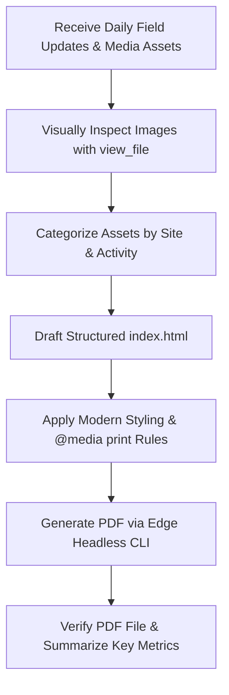

# Standard Operating Procedure (SOP) — Daily Operations HTML & PDF Report Generation

This guide serves as a comprehensive reference for AI Assistants generating Daily Operations Progress Reports across **Mucheru World of Golf**, **Chaka Farms**, **Kabete Residence**, and **Amani Cottage**.

---

## Workflow Overview



---

## 1. Domain & Location Categorization

| Site Location | Key Activities & Scope | Key Personnel / Supervisors | Color Token |
| :--- | :--- | :--- | :--- |
| **Mucheru World of Golf** | Dam excavation (Dam 1 & 2), soil haulage/dumping, green material delivery (hardcore, red soil, ballast), green sub-base laying, irrigation piping, entrance gates, fence asset transfers. | Ken, Mr. Gichuhi, Kinoti, Kamandau | `#15803d` (Golf Green) |
| **Chaka Farms** | Dairy production (morning/evening milking logs strictly in **Litres**), canine unit (kennels cleaning, dog bathing/grooming, manners, off-leash walking), plumbing repairs, paddock rain hose irrigation, compound maintenance. | Willy, Kamandau, Margaret & Monica | `#d97706` (Farm Amber) |
| **Kabete Residence** | Roof tile painting (main house, generator store, carpark canopy), fireplace clearance excavation, water tank slab rebar, cold room ventilation, veranda clearance, domestic pet care (**Ajabu** dog & resident cats). | Operations Overseen & Shared by: Njoki *(Not a site supervisor)* | `#6d28d9` (Residence Purple) |
| **Amani Cottage** | Front lawn CAN fertilizer application, rotary sprinkler irrigation, grounds litter collection, interior housekeeping (dusting, room arrangement). | Edwin, Housekeeper | `#0d9488` (Cottage Teal) |

---

## 2. Image Inspection & Reclassification SOP

1. **Mandatory Visual Inspection (`view_file`):**
   - **Never rely on filenames.** Raw image filenames (e.g. `WhatsApp Image 2026-08-12 at 16.44.35.jpeg`) contain no context.
   - Use `view_file` to visually open every image before assigning it to a section.
2. **Context-Aware Section Assignment:**
   - Verify the subject matter (e.g. excavator digging vs. worker laying hardcore stone vs. dog inside kennel stall vs. clean living room).
   - Place images into their exact corresponding card component and gallery.
3. **Pet Ownership Rule:**
   - Domestic pets (**Ajabu the Golden Retriever** and **resident cats Aiko/Reo**) belong to **Kabete Residence**, NOT Chaka Farms.
4. **Milk Units & Production vs. Allocation Rule:**
   - Dairy milk yield MUST ALWAYS be formatted in **Litres** (e.g., `8.0 Litres`, `Morning: 5.5L | Evening: 2.5L`), **NEVER** in Kilograms (KG/kg).
   - **Dairy Cow Milk Yield** is the **Total Gross Milk Production**.
   - **Allocations & Rations** (e.g., Goat Kids Ration, Gladys Allocation, Maasai Allocation, staff rations) are **deductions drawn from this total yield**, NOT additions. Never sum allocations with cow yield to fabricate a higher total. The total milk produced is strictly the gross cow yield, and deductions are subtracted to show net remaining farm balance.
5. **Heavy Plant Rule (Backhoe Loader):**
   - The **Front Loader** and **Backhoe** refer to the same physical machine (**Backhoe Loader** / XGMA 765N). Consolidate all earthmoving/loading hours under a single Backhoe Loader entry. Never split them into separate machines or create duplicate billing rows.
6. **Strict Grounding & Anti-Hallucination:**
   - AI assistants MUST NEVER assume, invent, or add unmentioned routine tasks (e.g. unstated shed cleaning, garden sweeping). Only report explicitly provided updates, verified media, and factual logs.
7. **Rich Visual Captions:**
   - Include a concise title (`<h4>`) and descriptive caption (`<p>`) detailing the observed equipment, progress stage, terrain, and operational details.
8. **Kabete Residence Personnel Rule (Njoki):**
   - **Njoki is NOT a supervisor.** She oversees daily operations and communicates/shares field updates on what has been accomplished. Never label her as a "supervisor" or write "under the supervision of Njoki".
9. **No Image Grouping Rule (Continuous Straight Photo Flow):**
   - **Stop putting images into groups.** Never divide photos into separate thematic cards, sub-groups, or multiple fragmented cards with distinct sub-headings (e.g., do not split Golf photos into "Fairway Clearing" vs "Green Foundation", or Kabete photos into "Structural Works" vs "Fireplace Excavation").
   - All photographic field evidence for each project site must be housed inside **one single continuous photo gallery card** titled `📸 Photographic Field Evidence — [Site Name]`.
   - All verified photos within that gallery must simply follow each other straight in the 2-column grid.

---

## 3. HTML Construction Best Practices

- **Header Section:** Slate-900 background (`#0f172a`), uppercase tag (`Operational Progress Report`), and date badge (`📅 Date`) with a clean, solid layout (no gradient bottom bar).
- **KPI Summary Bar:** Grid bar displaying 3–4 high-impact metrics (e.g., Dam Haulage Trips, Milk Yield in Litres, Roof Completion Percentage, Active Site Count).
- **Supervisor Badges:** Highlight key personnel on every card (`Overseen by: [Supervisor Name]`).
- **Data Tables:** HTML tables for quantitative data (e.g., Milking Yield logs in Litres with Morning/Evening/Total, Material Delivery allocation breakdowns).
- **Key Accomplishment Highlight Callouts:** Green boxes (`.success-box`) to showcase key accomplishments and completed objectives (e.g., `🎯 Key Accomplishment: Main House Roof Painting Complete`).
- **Photo Galleries:** Responsive grid layout with image cards containing captions.
- **Video Cards & Direct Drive Links:** Present each video in a dedicated `.video-card` component with an embedded `<video>` player, title, concise description, and an elegant styled button linking directly to Google Drive (`.video-drive-btn`). Never group multiple unrelated videos into one player.
- **Footer Signature:** Every report MUST always conclude with: `<h3>Compiled by Dennis</h3>`. Do NOT add or invent unmentioned job titles or subtitles.

---

## 4. PDF Print Rules & Execution

### Print CSS Rules (`@media print`)
```css
@media print {
    @page { size: A4; margin: 8mm 10mm; }
    
    /* Hide video players in PDF output and render clean header ribbon */
    .video-media-wrapper video, video { display: none !important; }
    .video-media-wrapper { 
        aspect-ratio: auto !important; 
        height: 36px !important; 
        background: #f1f5f9 !important; 
        border-bottom: 1px solid #cbd5e1 !important; 
        display: flex !important; 
        align-items: center !important; 
        padding: 0 14px !important; 
    }
    .video-media-wrapper::before { 
        content: "🎥 Video Recording" !important; 
        font-size: 0.78rem !important; 
        font-weight: 700 !important; 
        color: #334155 !important; 
        text-transform: uppercase !important; 
    }
    
    /* Prevent split elements across page boundaries */
    .card, .gallery-item, .video-card, footer { page-break-inside: avoid; }
    .section-header { page-break-after: avoid; }
    
    /* Ensure background colors and badges print accurately */
    * {
        -webkit-print-color-adjust: exact !important;
        print-color-adjust: exact !important;
    }
    
    /* Print-optimized grid & sizing */
    body { background-color: #ffffff; padding: 0; }
    .container { box-shadow: none; border: none; max-width: 100%; }
    .gallery-grid, .video-grid { grid-template-columns: repeat(2, 1fr); gap: 12px; }
    .gallery-item img { height: 155px; }
}
```

### CLI Command for Headless PDF Generation
```powershell
python -c "import subprocess; subprocess.run(['C:\\Program Files (x86)\\Microsoft\\Edge\\Application\\msedge.exe', '--headless', '--print-to-pdf=c:\\Users\\denni\\Downloads\\Reporting\\August 2026\\Report Xth Aug\\Daily_Operations_Report_Xth_August.pdf', 'c:\\Users\\denni\\Downloads\\Reporting\\August 2026\\Report Xth Aug\\index.html'])"
```

### Quality Assurance Checklist
- [x] HTML file opens cleanly in web browser.
- [x] All images visually verified and correctly captioned.
- [x] Dairy yield (strictly recorded in Litres) and material delivery tables accurate.
- [x] Heavy plant equipment consolidated as Backhoe Loader without duplicate entries.
- [x] All reported tasks strictly grounded in provided field updates (no hallucinated tasks).
- [x] Headless Edge PDF generated cleanly without errors.
- [x] PDF file size verified (5 MB – 40 MB).
- [x] Video players hidden in PDF while clickable Drive buttons remain clean and functional.
- [x] Follows the **Anti-Compression & Dedicated Page Budgeting Standard** (Section 5).

---

## 5. Anti-Compression & Dedicated Page Budgeting Standard

Executive reports MUST maintain generous breathing room, large readable fonts, and uncompressed cards. Never cram narratives, callouts, and data tables onto single pages to meet arbitrary page targets.

1. **Dedicated Full-Page Narrative Overviews**:
   - Each site's primary narrative card must have its own dedicated full page (`padding: 26px 30px`, body text `14.5px–15.5px`, line height `1.65–1.72`, bullets `13.8px–14.5px` with `13px–16px` margins). Fills ~75–85% of the page.
2. **Dedicated Full-Page Data Tables**:
   - Multi-row or complex data tables must be placed on their own dedicated page with generous cell padding (`12px–16px`) and readable font sizes (`12.5px–13px`).
3. **Dedicated Photo Galleries (Strictly 2 Columns & Continuous Straight Flow)**:
   - Field photos MUST ALWAYS display in a spacious **2-column grid** (`repeat(2, 1fr)`) with uncompressed image heights (`175px–195px`). Never compress photos into 3 columns.
   - **Continuous Flow (No Image Grouping):** Stop putting images into groups or multiple fragmented cards. All photos for each location must follow each other straight in a single continuous photo gallery card.
4. **Natural Page Count (Zero Artificial Compression)**:
   - Reports must expand naturally to whatever page count is required (e.g., 14, 16, 18, 20+ pages). Readability, generous breathing room, and executive aesthetic excellence always take precedence over any arbitrary page target.

