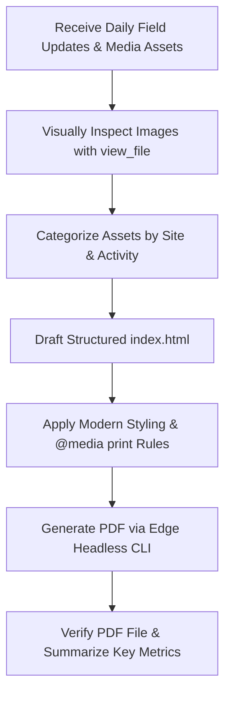

# Standard Operating Procedure (SOP) — Daily Operations HTML & PDF Report Generation

This guide serves as a comprehensive reference for AI Assistants generating Daily Operations Progress Reports across **Mucheru World of Golf**, **Chaka Farms**, **Kabete Residence**, and **Amani Cottage**.

---

## Workflow Overview


```mermaid
flowchart TD
    A[Receive Daily Field Updates & Media Assets] --> B[Visually Inspect Images with view_file]
    B --> C[Categorize Assets by Site & Activity]
    C --> D[Draft Structured index.html]
    D --> E[Apply Modern Styling & @media print Rules]
    E --> F[Generate PDF via Edge Headless CLI]
    F --> G[Verify PDF File & Summarize Key Metrics]
```

---

## 1. Domain & Location Categorization

| Site Location | Key Activities & Scope | Key Personnel / Supervisors | Color Token |
| :--- | :--- | :--- | :--- |
| **Mucheru World of Golf** | Dam excavation (Dam 1 & 2), soil haulage/dumping, green material delivery (hardcore, red soil, ballast), green sub-base laying, irrigation piping, entrance gates, fence asset transfers, and daily 18-hole Putting Greens (Greens 1–18) & Championship Teeboxes (Tees 1–18) status ledger (effective Sep 16th onwards). | Ken, Mr. Gichuhi, Kinoti, Kamandau | `#15803d` (Golf Green) |
| **Chaka Farms** | Dairy production (morning/evening milking logs strictly in **Litres**), canine unit (kennels cleaning, dog bathing/grooming, manners, off-leash walking), plumbing repairs, paddock rain hose irrigation, compound maintenance. | Willy, Kamandau, Margaret & Monica | `#d97706` (Farm Amber) |
| **Kabete Residence** | Roof tile painting (main house, generator store, carpark canopy), fireplace clearance excavation, water tank slab rebar, cold room ventilation, veranda clearance, domestic pet care (**Ajabu** dog & resident cats). | Operations Overseen & Shared by: Njoki *(Not a site supervisor)* | `#6d28d9` (Residence Purple) |
| **Amani Cottage** | Front lawn CAN fertilizer application, rotary sprinkler irrigation, grounds litter collection, interior housekeeping (dusting, room arrangement). | Edwin, Housekeeper | `#0d9488` (Cottage Teal) |

---

## 2. Image Inspection & Reclassification SOP

1. **Mandatory Visual Inspection (`view_file`):**
   - **Never rely on filenames.** Raw image filenames (e.g. `WhatsApp Image 2026-08-12 at 16.44.35.jpeg`) contain no context.
   - Use `view_file` to visually open every image before assigning it to a section.
2. **Context-Aware Section Assignment:**
   - Verify the subject matter (e.g. excavator digging vs. worker laying hardcore stone vs. dog inside kennel stall vs. clean living room).
   - Place images into their exact corresponding card component and gallery.
3. **Pet Ownership Rule:**
   - Domestic pets (**Ajabu the Golden Retriever** and **resident cats Aiko/Reo**) belong to **Kabete Residence**, NOT Chaka Farms.
4. **Milk Units & Reconciliation Rule (Effective October 1st, 2026 Onwards):**
   - Dairy milk yield MUST ALWAYS be formatted in **Litres** (e.g., `7.0 Litres`, `Morning: 2.5L | Evening: 2.5L`), **NEVER** in Kilograms (KG/kg).
   - **Commercial Sales Ground Truth:** The morning and evening numbers recorded by Kamandau in field logs represent the milk **sold/dispatched** for commercial sale (`Commercial Sales`).
   - **Internal Farm Allocations:** Routine disbursements (Goat Kids Ration [1.0L], Gladys [0.5L], Maasai [0.5L]) are shared on-farm in addition to commercial sales.
   - **Total Gross Cow Milk Production Formula:**
     $$\text{Total Gross Milk Harvested} = \text{Morning Sold} + \text{Evening Sold} + \text{Internal Farm Allocations}$$
     *(Example: 2.5L morning sold + 2.5L evening sold + 2.0L internal allocations = **7.0L Gross Cow Production**).*
   - **Ledger Presentation:** Daily dairy tables must clearly present Commercial Sales Dispatches, Internal Farm Allocations, and Total Gross Milk Harvested (fully balanced with zero discrepancy).
5. **Heavy Plant Rule (Backhoe Loader):**
   - The **Front Loader** and **Backhoe** refer to the same physical machine (**Backhoe Loader** / XGMA 765N). Consolidate all earthmoving/loading hours under a single Backhoe Loader entry. Never split them into separate machines or create duplicate billing rows.
6. **Strict Grounding & Simple Plain Language:**
   - AI assistants MUST NEVER assume, invent, or add unmentioned routine tasks (e.g. unstated shed cleaning, garden sweeping). Only report explicitly provided updates, verified media, and factual logs.
   - **Simple Vocabulary Rule (No Heavy Technical Terms):** Keep vocabulary simple, direct, and straightforward across narratives, tables, and photo captions. Strictly avoid unnecessary heavy technical jargon (e.g., use "red soil spread around greens to level the ground" instead of "red loam topsoil application to contour aprons and feather green complexes into playing corridors").
7. **Rich Visual Captions:**
   - Include a concise title (`<h4>`) and descriptive caption (`<p>`) detailing the observed equipment, progress stage, terrain, and operational details in clear, simple language.
8. **Kabete Residence Personnel Rule (Njoki):**
   - **Njoki is NOT a supervisor.** She oversees daily operations and communicates/shares field updates on what has been accomplished. Never label her as a "supervisor" or write "under the supervision of Njoki".
9. **No Image Grouping Rule (Continuous Straight Photo Flow):**
   - **Stop putting images into groups.** Never divide photos into separate thematic cards, sub-groups, or multiple fragmented cards with distinct sub-headings (e.g., do not split Golf photos into "Fairway Clearing" vs "Green Foundation", or Kabete photos into "Structural Works" vs "Fireplace Excavation").
   - All photographic field evidence for each project site must be housed inside **one single continuous photo gallery card** titled `📸 Photographic Field Evidence — [Site Name]`.
   - All verified photos within that gallery must simply follow each other straight in the 2-column grid.
10. **Minimal Cropping Rule for Images in Cards (Preserve Main Subject):**
    - When placing images in cards, there must be **minimal cropping** of the image.
    - Images fail to serve their purpose if the main subject (workers, heavy plant equipment, pets, structural masonry, gates, roofs) is cropped off.
    - Always display card images so the entire photograph is visible without slicing off the subject. Use `object-fit: contain; background-color: #f8fafc;` (or flexible containers) so photos are never cropped aggressively.
11. **Daily Greens & Teeboxes Status Audit Rule (Effective From 16th September 2026 Onwards):**
    - Daily operations reports must include the complete 18-hole **Putting Greens Status (Greens 1–18)** and **Championship Teeboxes Status (Tees 1–18)** status tables, plus the **Operations Synthesis** summary box, as modeled in `September 2026/Course Status Greens and Tees/Mucheru_Golf_Greens_and_Tees_Status_Report.pdf`.
    - **Latest Activity & Single Date Only Rule (Putting Greens):**
      - In the `Current Technical & Agronomic State` column, **only state what was done last**.
      - **NEVER** give status for more than 1 previous date or accumulate historical progression lists.
      - Use **just the latest date** a green was worked on (e.g., `Surplus red soil spread around outer surrounds and leveled (Sep 30)`).
    - **Day-to-Day State Tracking Rule:** Only update the greens and tees that underwent active work on that specific day (updating technical status, badge tag, and date marker e.g. `(Sep 16)`). If there was no work on certain greens or tees on that day, **leave them exactly as they were recorded on the previous day's report** without altering them. Continuous state tracking flows forward day-to-day.
    - **Subtle Visual Indicator for Changed Items (`.row-changed` & `.badge-today`):**
      - Any green or teebox modified on that day must have `class="row-changed"` on its table row (`<tr>`).
      - This adds a subtle 3.5px solid golf-green left accent border (`border-left: 3.5px solid #15803d;`) to the first cell (`td:first-child`) and a very soft green row background tint (`#f0fdf4`).
      - The ID cell includes an elegant micro-pill badge: `<span class="badge-today">Today</span>` (e.g., `<td class="col-id">Green 1 <span class="badge-today">Today</span></td>`).
      - Unchanged rows retain standard clean styling without badges or border accents.

---

## 3. HTML Construction Best Practices

- **Header Section:** Slate-900 background (`#0f172a`), uppercase tag (`Operational Progress Report`), and date badge (`📅 Date`) with a clean, solid layout (no gradient bottom bar).
- **KPI Summary Bar:** Grid bar displaying 3–4 high-impact metrics (e.g., Dam Haulage Trips, Milk Yield in Litres, Roof Completion Percentage, Active Site Count).
- **Supervisor Badges:** Highlight key personnel on every card (`Overseen by: [Supervisor Name]`).
- **Data Tables:** HTML tables for quantitative data (e.g., Milking Yield logs in Litres with Morning/Evening/Total, Material Delivery allocation breakdowns).
- **Course Engineering & Agronomy Status Tables (`.status-table`):** Standardized 3-column audit tables for 18 Putting Greens and 18 Championship Teeboxes. Uses alternating row shading, fixed ID and Tag column widths, and color-coded status badges (`.tag-ready`, `.tag-sand`, `.tag-trenched`, `.tag-neutral`, `.tag-pending`), alongside an Operations Synthesis summary card (`.summary-card`).
- **Key Accomplishment Highlight Callouts:** Green boxes (`.success-box`) to showcase key accomplishments and completed objectives (e.g., `🎯 Key Accomplishment: Main House Roof Painting Complete`).
- **Photo Galleries:** Responsive grid layout with image cards containing captions.
- **Video Cards & Direct Drive Links:** Present each video in a dedicated `.video-card` component with an embedded `<video>` player, title, concise description, and an elegant styled button linking directly to Google Drive (`.video-drive-btn`). Never group multiple unrelated videos into one player.
- **Single Source of Truth (Direct Authoring):** AI assistants must ALWAYS create, edit, and maintain `index.html` directly using native file tools (`write_to_file`, `replace_file_content`). NEVER write separate Python or Node generator scripts to assemble or update HTML reports.
- **Footer Signature:** Every report MUST always conclude with: `<h3>Compiled by Dennis</h3>`. Do NOT add or invent unmentioned job titles or subtitles.

---

## 4. PDF Print Rules & Execution

### Print CSS Rules (`@media print`)
```css
@media print {
    @page { size: A4; margin: 8mm 10mm; }
    
    /* Hide video players in PDF output and render clean header ribbon */
    .video-media-wrapper video, video { display: none !important; }
    .video-media-wrapper { 
        aspect-ratio: auto !important; 
        height: 36px !important; 
        background: #f1f5f9 !important; 
        border-bottom: 1px solid #cbd5e1 !important; 
        display: flex !important; 
        align-items: center !important; 
        padding: 0 14px !important; 
    }
    .video-media-wrapper::before { 
        content: "🎥 Video Recording" !important; 
        font-size: 0.78rem !important; 
        font-weight: 700 !important; 
        color: #334155 !important; 
        text-transform: uppercase !important; 
    }
    
    /* Prevent split elements across page boundaries */
    .card, .gallery-item, .video-card, footer { page-break-inside: avoid; }
    .section-header { page-break-after: avoid; }
    
    /* Ensure background colors and badges print accurately */
    * {
        -webkit-print-color-adjust: exact !important;
        print-color-adjust: exact !important;
    }
    
    /* Print-optimized grid & sizing */
    body { background-color: #ffffff; padding: 0; }
    .container { box-shadow: none; border: none; max-width: 100%; }
    .gallery-grid, .video-grid { grid-template-columns: repeat(2, 1fr); gap: 12px; }
    .gallery-item img { height: 165px; object-fit: contain; background-color: #f8fafc; }

    /* Status tables print optimization */
    .status-table { font-size: 9.8px !important; }
    .status-table th { padding: 5px 8px !important; font-size: 9px !important; }
    .status-table td { padding: 4px 8px !important; font-size: 9.6px !important; line-height: 1.32 !important; }
    .status-table tr { page-break-inside: avoid !important; break-inside: avoid !important; }
    .status-table tr.row-changed { background-color: #f0fdf4 !important; }
    .status-table tr.row-changed td:first-child { border-left: 3.5px solid #15803d !important; font-weight: 800; }
    .badge-today {
        display: inline-block; font-size: 8px !important; font-weight: 700 !important;
        text-transform: uppercase; color: #15803d !important; background-color: #dcfce7 !important;
        border: 1px solid #86efac !important; padding: 1px 5px !important; border-radius: 8px; margin-left: 5px;
    }
    .col-id { width: 70px !important; }
    .col-tag { width: 150px !important; }
    .tag { font-size: 8.5px !important; padding: 1px 5px !important; }
    .summary-card { padding: 9px 12px !important; margin-top: 10px !important; margin-bottom: 10px !important; }
    .summary-card h4 { font-size: 10.5px !important; margin-bottom: 3px !important; }
    .summary-card p { font-size: 9.5px !important; line-height: 1.35 !important; }
}
```

### CLI Command for Headless PDF Generation
```powershell
python -c "import subprocess; subprocess.run(['C:\\Program Files (x86)\\Microsoft\\Edge\\Application\\msedge.exe', '--headless', '--print-to-pdf=c:\\Users\\denni\\Downloads\\Reporting\\August 2026\\Report Xth Aug\\Daily_Operations_Report_Xth_August.pdf', 'c:\\Users\\denni\\Downloads\\Reporting\\August 2026\\Report Xth Aug\\index.html'])"
```

### Quality Assurance Checklist
- [x] HTML file opens cleanly in web browser.
- [x] All images visually verified and correctly captioned.
- [x] Dairy yield (strictly recorded in Litres) and material delivery tables accurate.
- [x] Heavy plant equipment consolidated as Backhoe Loader without duplicate entries.
- [x] Daily Putting Greens (1–18) and Championship Teeboxes (1–18) status audit ledger included and updated from previous day (reports from Sep 16th onwards).
- [x] All reported tasks strictly grounded in provided field updates (no hallucinated tasks).
- [x] Headless Edge PDF generated cleanly without errors.
- [x] PDF file size verified (5 MB – 40 MB).
- [x] Video players hidden in PDF while clickable Drive buttons remain clean and functional.
- [x] Follows the **Anti-Compression & Dedicated Page Budgeting Standard** (Section 5).

---

## 5. Anti-Compression & Dedicated Page Budgeting Standard

Executive reports MUST maintain generous breathing room, large readable fonts, and uncompressed cards. Never cram narratives, callouts, and data tables onto single pages to meet arbitrary page targets.

1. **Dedicated Full-Page Narrative Overviews**:
   - Each site's primary narrative card must have its own dedicated full page (`padding: 26px 30px`, body text `14.5px–15.5px`, line height `1.65–1.72`, bullets `13.8px–14.5px` with `13px–16px` margins). Fills ~75–85% of the page.
2. **Dedicated Full-Page Data Tables**:
   - Multi-row or complex data tables must be placed on their own dedicated page with generous cell padding (`12px–16px`) and readable font sizes (`12.5px–13px`).
3. **Dedicated Spreads for Greens & Teeboxes Status Ledgers (From Sep 16th Onwards)**:
   - The 18-hole **Putting Greens Status (Greens 1 – 18)** table must occupy its own dedicated full page in print.
   - The 18-hole **Championship Teeboxes Status (Tees 1 – 18)** table alongside the **Operations Synthesis** summary box must occupy its own dedicated full page in print.
   - Print font size ~`9.8px`, padding ~`4px 8px`, ensuring clean 1-page fit per 18-row table without spilling or overflow.
4. **Dedicated Photo Galleries (Strictly 2 Columns, Continuous Flow & Minimal Cropping)**:
   - Field photos MUST ALWAYS display in a spacious **2-column grid** (`repeat(2, 1fr)`). Never compress photos into 3 columns.
   - **Continuous Flow (No Image Grouping):** Stop putting images into groups or multiple fragmented cards. All photos for each location must follow each other straight in a single continuous photo gallery card.
   - **Minimal Cropping Standard:** Use `object-fit: contain; background-color: #f8fafc;` with generous height (`200px–260px`, print: `165px`) so the complete photo and its main subject (workers, machinery, pets, construction elements) are 100% visible and uncropped.
5. **Natural Page Count (Zero Artificial Compression)**:
   - Reports must expand naturally to whatever page count is required (e.g., 14, 16, 18, 20+ pages). Readability, generous breathing room, and executive aesthetic excellence always take precedence over any arbitrary page target.


